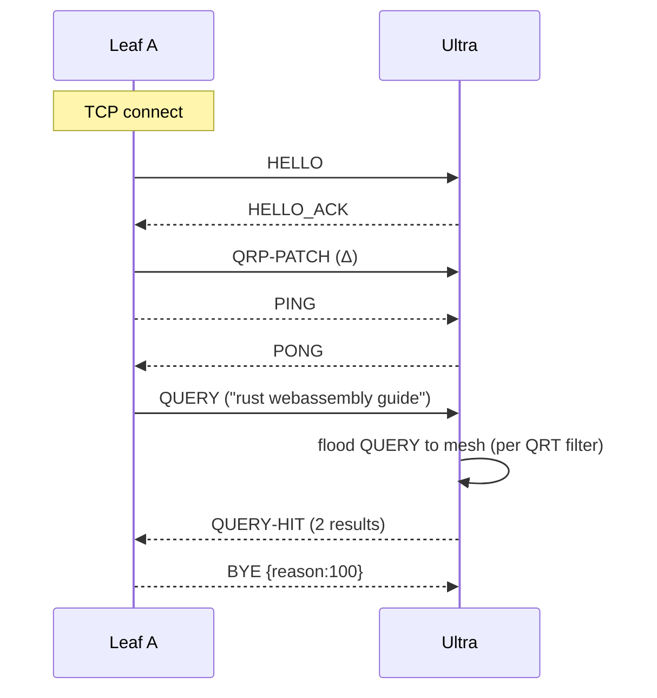

# Hazelhop Protocol Specification

**Version**: 0.1
**Status**: Draft
**Date**: 2025‑07‑01

---

## Table of Contents

1. Introduction
2. Goals
3. Design Principles
4. Terminology
5. Architectural Overview
6. Transport Layer Requirements
7. Connection Lifecycle
     7.1 Handshake
     7.2 Keep‑Alive & Liveness
     7.3 Graceful Shutdown
8. Message Envelope
9. Message Types
     9.1 HELLO
     9.2 BYE
     9.3 PING
     9.4 PONG
     9.5 QRP‑PATCH
     9.6 QRP‑RESET
     9.7 QUERY
     9.8 QUERY‑HIT
10. Query Routing (QRP)
11. Security Considerations
12. Extensibility
13. Error Handling
14. References
15. Appendix A – Example Session
16. Appendix B – ABNF Definitions

---

## 1  Introduction

Hazelhop is a peer‑to‑peer (P2P) search protocol for sharing HTTP/HTTPS URLs and their accompanying metadata. It is a modern, transport‑agnostic re‑imagining of the Gnutella 0.6 search layer, intentionally **excluding** any specification for bulk file transfer. Hazelhop focuses on three pillars:

- **Usefulness** – Provide enough semantic richness to make the network valuable in real‑world use.
- **Portability** – Encourage multiple independent client implementations by minimising ambiguity and external dependencies.
- **Pragmatism** – Re‑use existing, widely‑adopted standards wherever feasible.

## 2  Goals (Non‑Normative)

- **G1. Discoverability** – Quickly locate URLs and associated metadata (title, description, checksum).
- **G2. Low Barrier to Entry** – A developer should be able to write a minimal Hazelhop client in a weekend.
- **G3. Forward Compatibility** – Old clients MUST inter‑operate gracefully with newer protocol versions.
- **G4. Transport Flexibility** – Operation over TCP, WebSocket, QUIC, or even non‑IP media is possible as long as a reliable, ordered, duplex UTF‑8 channel is provided.

## 3  Design Principles

- **P1. Transport‑Agnostic Core** – The spec describes messages, not wires. Transports are profiled separately.
- **P2. Text‑First** – All control messages are UTF‑8 JSON; binary blobs are Base32 encoded when necessary.
- **P3. Minimal Handshake** – A two‑step exchange establishes identity, capabilities, and Query Routing Table (QRT) state.
- **P4. Shared Vocabulary** – Tokenisation and hashing mirror Gnutella’s well‑studied behaviour to reduce invention.

## 4  Terminology (Normative)

| Term           | Definition                                                                             |
| -------------- | -------------------------------------------------------------------------------------- |
| **Node**       | Any endpoint participating in Hazelhop.                                                |
| **Leaf Node**  | A node that offloads QRP filtering to an **Ultra Node**.                               |
| **Ultra Node** | A node that maintains QRTs for itself **and** its connected leaves.                    |
| **QRT**        | Query Routing Table – a Bloom‑filter‑like bit‑vector used to pre‑filter QUERY traffic. |
| **Channel**    | A bidirectional, ordered, reliable stream of UTF‑8 code units.                         |
| **Message**    | A JSON‑encoded document conforming to §8.                                              |

## 5  Architectural Overview

Hazelhop follows an unstructured overlay with optional two‑tier optimisation:

- **Leaf Nodes** connect to one or more Ultra Nodes.
- **Ultra Nodes** interconnect in a partial mesh and perform query routing via QRT propagation (§10).

No node is _required_ to be Ultra; role selection is heuristic and implementation‑defined.

## 6  Transport Layer Requirements (Normative)

A conforming **Channel** MUST provide:

1. **Reliability** – octets are delivered in order and without loss.
2. **Duplexity** – both peers can send at any time after handshake.
3. **UTF‑8 Transparency** – all bytes outside the 0x00‑0x7F range MUST survive unchanged.

> **Note**: TLS, Noise, or other encryption layers MAY wrap the channel but are out of scope of this specification.

## 7  Connection Lifecycle

### 7.1  Handshake

```
Client              Server

HELLO     ───────────────▶
HELLO_ACK ◀───────────────
(Channel is now *OPEN*)
```

- The **Client** is whichever side initiated the underlying transport.
- Either side MAY immediately send QRP‑PATCH after handshake.

### 7.2  Keep‑Alive & Liveness

- Implementations SHOULD transmit a **PING** at a regular interval, specified at an interval determined by the connections channel.

### 7.3  Graceful Shutdown

- Send **BYE** with an optional reason code, then close the underlying channel.

## 8  Message Envelope (Normative)

All Hazelhop messages are JSON‑RPC 1.0 objects encoded in UTF‑8 without BOM.

```jsonc
{
  "id"    : "<anything>" | null,  // Required by JSON‑RPC 1.0
  "method": "HELLO",              // Command (§9)
  "params": { /* NOT CORRECT - JSON RPC 1.0 uses arrays */ }
}
```

- Notifications (no reply expected) set `"id": null`.
- Replies use `"result"` or `"error"` per JSON‑RPC 1.0.

## 9  Message Types

### 9.1  HELLO

Establishes protocol parameters.

| Field          | Type           | Required | Description                                                  |
| -------------- | -------------- | -------- | ------------------------------------------------------------ |
| `node_id`      | string         | ✔        | Stable, case‑insensitive, Base32‑encoded 160‑bit identifier. |
| `proto_ver`    | string         | ✔        | Highest spec version understood (e.g. "0.1").                |
| `agent`        | string         | ✔        | Free‑form client string ("hazelhop‑ts/0.3").                 |
| `capabilities` | array\<string> | ✖        | e.g. `["qrp", "gzip"]`.                                      |
| `qrt`          | string         | ✖        | Base32‑encoded bit vector (8192 B).                          |

**Response**: `HELLO_ACK` (same schema) or JSON‑RPC error `-32000 (HandshakeFailed)`.

### 9.2  BYE

Notification. Peers MUST close the channel after sending.

| Field    | Type   | Required | Description                          |
| -------- | ------ | -------- | ------------------------------------ |
| `reason` | int    | ✖        | Three‑digit shutdown code (see §13). |
| `msg`    | string | ✖        | Human‑readable diagnostics.          |

### 9.3  PING / 9.4  PONG

Keep‑alive pair.

| Field   | Type   | Required | Description                                  |
| ------- | ------ | -------- | -------------------------------------------- |
| `nonce` | string | ✔       | 8‑byte random token echoed back in **PONG**. |
| `ttl`   | int    | ✖       | Hop limit (default = 7).                     |

### 9.5  QRP‑PATCH

Incrementally updates the peer’s stored QRT.

| Field    | Type   | Required | Description                                      |
| -------- | ------ | -------- | ------------------------------------------------ |
| `offset` | int    | ✔       | Byte offset into 8192‑byte table. Multiple of 8. |
| `data`   | string | ✔       | Base32‑encoded bytes. Length ≤ 256.              |

### 9.6  QRP‑RESET

Replaces entire QRT.

| Field | Type   | Required | Description                                     |
| ----- | ------ | -------- | ----------------------------------------------- |
| `qrt` | string | ✔       | Base32‑encoded, exactly 8192 B before encoding. |

### 9.7  QUERY

| Field      | Type           | Required | Description                                       |
| ---------- | -------------- | -------- | ------------------------------------------------- |
| `guid`     | string         | ✔       | 128‑bit request identifier, Base32.               |
| `tokens`   | array\<string> | ✔       | UTF‑8 search terms (already tokenised per §10.2). |
| `ttl`      | int            | ✖       | Default = 7.                                      |
| `max_hits` | int            | ✖       | Advisory cap (default = 100).                     |

### 9.8  QUERY‑HIT

Response to **QUERY**.

| Field     | Type           | Required | Description                    |
| --------- | -------------- | -------- | ------------------------------ |
| `guid`    | string         | ✔       | GUID of the originating query. |
| `results` | array\<object> | ✔       | Up to _N_ result records.      |

Each _result_ object:

| Field         | Type   | Required | Description                                |
| ------------- | ------ | -------- | ------------------------------------------ |
| `url`         | string | ✔       | Absolute URL, ≤ 2000 chars.                |
| `title`       | string | ✖       | ≤ 80 chars, UTF‑8.                         |
| `description` | string | ✖       | ≤ 2000 chars.                              |
| `checksum`    | string | ✖       | SHA‑256 hex of target resource (optional). |

## 10  Query Routing (QRP)

Hazelhop adopts Gnutella 0.6’s Query Routing Protocol wholesale:

- **Table Size**: 8192 bytes (65 536 bits).
- **Hashing**: Four hash functions `H0…H3` derived from CRC‑32 (§10.1).
- **Tokenisation**: Same normalisation pipeline (lowercase, drop stop‑words, etc.).

A node MAY serve as QRT aggregator for its leaves (“Ultra Node”). Patch semantics match LimeWire’s deflate‑like model; see Appendix A for flow.

## 11  Security Considerations (Informative)

- **Eavesdropping** – Deploy TLS 1.3 or Noise Pipes to protect payloads.
- **Sybil Defence** – Employ proof‑of‑work or reputation systems at higher layers.
- **Spam** – Implement query rate‑limits and QRT accuracy scoring.

## 12  Extensibility

- New commands MUST prefix with `X‑` until ratified.
- Message‑level compression MAY be negotiated via `capabilities`.

## 13  Error Handling

| Code   | Meaning              |
| ------ | -------------------- |
| -32000 | HandshakeFailed      |
| -32001 | UnsupportedVersion   |
| -32010 | InvalidParams        |
| 100    | NormalShutdown (BYE) |
| 101    | GoingAway            |
| 102    | ProtocolError        |

## 14  References

- Gnutella 0.6 Specification (2002)
- JSON‑RPC 1.0 Specification (2005)
- IETF RFC 3986 – Uniform Resource Identifier (URI)
- IETF RFC 4648 – Base 32 Data Encoding

## 15  Appendix A – Example Session



## 16  Appendix B – ABNF

```
NODEID   = 32*BASE32    ; 160‑bit value
GUID     = 26*BASE32    ; 128‑bit value
BASE32   = %x41-5A / %x32-37   ; A‑Z / 2‑7
```

---

# Hazelhop Protocol Specification

_Draft 0.1 – July 1 2025_

> Hazelhop is a peer‑to‑peer search protocol for discovering and sharing HTTP/S **URLs**. It is a spiritual successor to the Gnutella protocol: everything that worked in Gnutella is preserved, while anachronisms (binary framing, fixed TCP ports, IPv4 assumptions, etc.) are removed. Hazelhop focuses **only** on search and discovery; it intentionally omits any specification for file transport.

---

## 1  Purpose & Scope

Hazelhop defines the message formats, connection life‑cycle, and query‑routing rules that enable two or more peers to locate URLs in a fully decentralized manner. Transport details (TCP, UDP, WebSocket, Sneakernet…) and encryption are **explicitly out of scope** – the protocol assumes only a _bidirectional, reliable, byte‑oriented channel_ capable of exchanging UTF‑8 text.

## 2  Design Goals

1. **Usefulness** – the protocol must solve a real problem and expose primitives that modern applications actually need.
2. **Portability** – specification wording should encourage multiple independent implementations; no dependence on exotic stacks.
3. **Pragmatism** – leverage existing Internet standards (JSON, Base‑32, URL syntax, JSON‑RPC 1.0) whenever reasonable.

## 3  Conformance Language

Key words **MUST**, **MUST NOT**, **SHOULD**, **SHOULD NOT**, and **MAY** are to be interpreted as described in RFC 2119.

## 4  Terminology

| Term               | Meaning                                                                          |
| ------------------ | -------------------------------------------------------------------------------- |
| **Node / Peer**    | A running Hazelhop implementation participating in the network.                  |
| **Connector**      | The side that initiates a connection.                                            |
| **Conectee**       | The side that accepts an incoming connection.                                    |
| **Duplex Channel** | Any medium that provides simultaneous, bidirectional, ordered delivery of bytes. |
| **Message**        | A single JSON object framed as UTF‑8 text followed by LF (U+000A).               |
| **QRP Table**      | A Bloom‑filter‑like bit‑set used for query routing (see § 10).                   |

---

## 5  Transport Requirements

- The channel **MUST** be able to deliver arbitrary UTF‑8 code‑points.
- Implementations **MUST** frame each message as a single UTF‑8 JSON text followed by a line‑feed (\n). No NULL bytes are permitted within a message.
- Maximum message size is **65 536 bytes** (including framing LF). A node **MAY** close the connection on larger frames.
- If encryption or integrity protection is desired, peers **SHOULD** establish it outside of the Hazelhop layer (e.g., TLS, WSS, NTLS over UUCP, etc.).

---

## 6  Connection Life‑Cycle

### 6.1 Handshake

1. **CONNECT** – The Connector sends a `CONNECT` message containing its node‑id, software agent, optional capabilities list, and (optionally) an initial QRP table patch.
2. **WELCOME** – The Conectee replies with a `WELCOME` message supplying the same metadata and its own QRP information. After both sides have exchanged these two messages, the connection is considered _established_.

Handshake Messages:

```jsonc
// CONNECT (from Connector)
{
  "cmd": "CONNECT",
  "ver": "0.1",
  "id": "base32‑node‑id",
  "agent": "hazelhop‑bun/0.4.0",
  "caps": ["qrp", "gzip"],
  "qrp": { /* optional QRP_RESET or QRP_PATCH */ }
}

// WELCOME (from Conectee)
{
  "cmd": "WELCOME",
  "ver": "0.1",
  "id": "base32‑node‑id",
  "agent": "hazelhop‑go/0.3.1",
  "caps": ["qrp"],
  "qrp": { /* optional */ }
}
```

### 6.2 Steady State

Once the handshake completes, either peer **MAY** send any command defined in § 8 at any time, subject to message semantics (e.g., `PONG` must correspond to a preceding `PING`).

### 6.3 Termination

- A graceful disconnect uses the `BYE` command (§ 8.7).
- An ungraceful disconnect is simply connection closure at the transport layer.

---

## 7  Message Envelope

Each message is a JSON object with the following common fields:

| Field  | Type     | Required | Description                                                        |
| ------ | -------- | -------- | ------------------------------------------------------------------ |
| `cmd`  | `string` | **Yes**  | Command name (uppercase, ASCII)                                    |
| `ver`  | `string` | **Yes**  | Hazelhop spec version understood by the sender – currently `"0.1"` |
| `seq`  | `number` | No       | Sender‑local monotonically increasing sequence number              |
| `ttl`  | `number` | No       | Hop‑limit; defaults to 7; decremented by each forwarding peer      |
| `body` | `object` | Varies   | Command‑specific payload                                           |

Implementations **MUST** ignore unknown top‑level properties to enable forward compatibility.

---

## 8  Commands

### 8.1 PING

| Field | Type     | Notes                |
| ----- | -------- | -------------------- |
| `id`  | `string` | UUID or base32 nonce |

A reachability probe that **MAY** be flooded through the network. Recipients **SHOULD** respond with a `PONG` unless rate‑limited.

### 8.2 PONG

Response to `PING`. Mirrors the `id` and reports summary data:

```jsonc
{
  "cmd": "PONG",
  "body": {
    "id": "<same‑id>",
    "urls_shared": 1234,
    "uptime_sec": 86400,
  },
}
```

### 8.3 QRP_RESET

Resets the remote peer’s idea of this node’s Query Routing Table.

```jsonc
{
  "cmd": "QRP_RESET",
  "body": {
    "table_id": "sha256‑hex",
    "bits": 262144, // total bit‑length (MUST be power‑of‑two)
  },
}
```

After a reset, at least one `QRP_PATCH` **MUST** follow to populate the table.

### 8.4 QRP_PATCH

Incremental update to the current QRP table.

```jsonc
{
  "cmd": "QRP_PATCH",
  "body": {
    "offset": 0, // bit offset, multiple of 5
    "data": "mybase32data", // Base32‑encoded bits; LSB‑first per byte
  },
}
```

Multiple patches may be sent back‑to‑back.

### 8.5 QUERY

A search request propagated through the network.

```jsonc
{
  "cmd": "QUERY",
  "ttl": 5,
  "body": {
    "id": "uuid",
    "q": "summer vacation 2003", // UTF‑8 text
    "max": 50, // desired max hits
  },
}
```

Forwarding peers **MUST** consult their QRP table (if any) before propagating.

### 8.6 QUERY_HIT

Reply carrying zero or more matching URLs.

```jsonc
{
  "cmd": "QUERY_HIT",
  "body": {
    "id": "<query‑id>",
    "hits": [
      {
        "url": "https://archive.org/file.mp4",
        "title": "Vacation 2003",
        "size": 5000000,
      },
    ],
  },
}
```

### 8.7 BYE

Graceful shutdown.

```jsonc
{
  "cmd": "BYE",
  "body": { "reason": "idle timeout" },
}
```

After sending `BYE`, a node **MUST** close the transport channel.

### 8.8 Vendor Extensions

Command names beginning with `X‑` are reserved for experimental or vendor‑specific use. Peers **SHOULD** ignore unrecognized commands.

---

## 9  Forwarding Rules & TTL

- Every hop **MUST** decrement `ttl`; packets with `ttl` ≤ 0 **MUST** be discarded.
- A node **SHOULD NOT** forward duplicate messages (same `cmd`, `id`, and immediate sender) within a 120‑second window.

## 10  Query Routing Table (QRP)

Hazelhop adopts the Gnutella v0.6 QRP concept with modern tweaks:

- Table length **MUST** be a power‑of‑two between 32 768 and 1 048 576 bits.
- Tokenization: Unicode word‑breaks, lower‑case, NFKC normalization, removal of characters in _Z_ and _P_ categories.
- Hashing: 64‑bit FNV‑1a; low‑order `log₂(bits)` bits select the bucket.
- A `QUERY` matches if ≥ 2⁄3 of its tokens have set bits in the neighbor’s QRP.

## 11  Security Considerations

Because Hazelhop is transport‑agnostic, implementers **SHOULD** run the protocol inside an authenticated, encrypted channel (e.g., TLS, Noise Pipes) when operating over untrusted networks. Peers **SHOULD** bound inbound message rates and maintain a per‑sender byte budget to mitigate flooding attacks.

## 12  Example Session (TCP)

```
Client  →  Server   CONNECT {…}
Server  →  Client   WELCOME {…}
Client  →  Server   QUERY   {…}
Server  →  Client   QUERY_HIT {…}
Client  →  Server   BYE     {…}
[close TCP]
```

## 13  Change Log

*0.1 – 2025‑07‑01*  Initial draft.

## 14  References

RFC 2119, ECMA‑404 (JSON), RFC 4648 (Base32), JSON‑RPC 1.0, Gnutella V0.6 Specification, FNV Hash.
